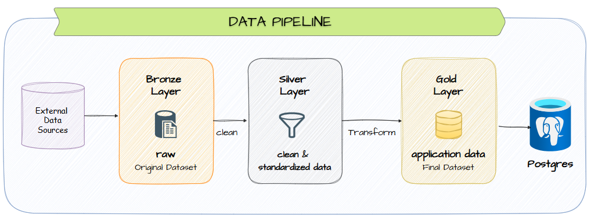

## 3. Data Pipeline

The project uses a lightweight **Medallion-style data pipeline** to transform
heterogeneous source datasets into application-ready data.



### Bronze Layer — Raw Data

The Bronze layer stores the original downloaded datasets with minimal or no
modification.

Examples:

- C-MAPSS engine sensor files
- FAA aircraft and engine files
- aviation spare-parts dataset
- supply-chain datasets
- e-commerce datasets

The purpose of this layer is to preserve the original source data.

### Silver Layer — Cleaned & Standardized Data

The Silver layer transforms raw data into consistent records.

Typical processing includes:

- removing duplicates;
- handling missing values;
- standardizing column names and data types;
- normalizing identifiers;
- validating numeric and categorical values;
- mapping aircraft, engines, products and suppliers across sources.

Example:

```text
FAA ENGINE.txt
        +
Aircraft Reference Data
        ↓
Clean & Standardize
        ↓
engine_models.csv
```

Run the active pipeline from the project root:

```text
python data/scripts/bronze_to_silver/clean.py
python data/scripts/silver_to_gold/build_gold.py
python data/scripts/silver_to_gold/build_gold.py --check
```

### Gold Layer — Application-Ready Data

The Gold layer contains data structured according to the application's
PostgreSQL schema.

Examples:

```text
companies
addresses
categories
engine_models
suppliers
aircraft
engines
products
seller_listings
product_engine_compatibility
```

Gold data can then be loaded into PostgreSQL as seed/reference data.

Unlike an analytical data warehouse, the Gold layer in this project represents
**application-ready operational data**, not analytical data marts.

---
