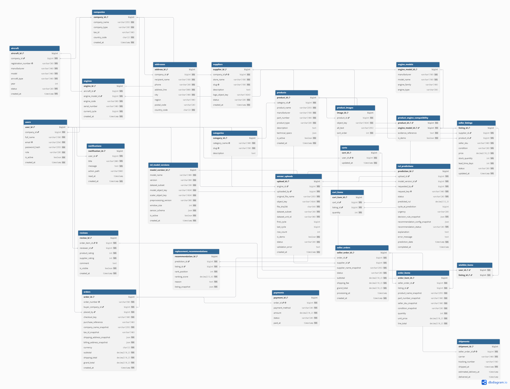
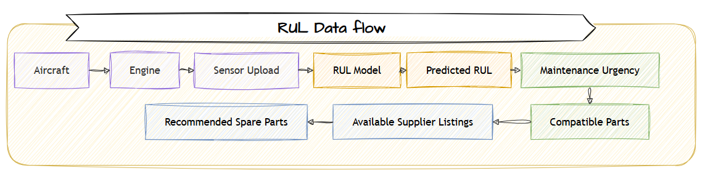

# Database & Data Pipeline

The Aviation B2B E-Commerce Platform combines aviation, engine-health,
supply-chain, and e-commerce data into a unified PostgreSQL database.

The database supports three connected domains:

**Aircraft & Engine → RUL Prediction → Spare-Part Recommendation → B2B Purchase**

## 1. Database Design

The system uses **PostgreSQL** as the primary operational database.

The database is organized around five main domains:

| Domain | Main Tables |
|---|---|
| Identity & Organization | `users`, `companies`, `addresses` |
| Aviation Assets | `aircraft`, `engines`, `engine_models` |
| Marketplace | `products`, `suppliers`, `seller_listings`, `product_engine_compatibility` |
| Commerce | `carts`, `orders`, `order_items`, `payments`, `shipments`, `reviews` |
| AI / RUL | `sensor_uploads`, `ml_model_versions`, `rul_predictions`, `replacement_recommendations` |

### ERD



- Schema definition: [`database-schema.dbml`](./database-schema.dbml)
- Interactive documentation: https://dbdocs.io/billbush0511/ERD-B2B-ecommerce-RUL-Website?view=relationships

---

## 2. Data Sources

The platform requires data from multiple domains because no single dataset
contains aircraft information, engine sensor data, spare parts, suppliers,
inventory, and e-commerce transactions together.

| Source | Usage |
|---|---|
| NASA C-MAPSS | Engine sensor data and RUL model development |
| FAA Aircraft / Engine Data | Aircraft and engine reference data |
| Aviation Spare Parts Dataset | Aviation spare-part information |
| Supply Chain Datasets | Supplier, inventory, lead-time and availability data |
| E-Commerce Datasets | Orders, payments, shipping and review structures |
| Application-Generated Data | Users, carts, predictions, recommendations and transactions |

---

## 3. Data Pipeline

The project uses a lightweight **Medallion-style data pipeline** to transform
heterogeneous source datasets into application-ready data.


### Bronze Layer — Raw Data

The Bronze layer stores the original downloaded datasets with minimal or no
modification.

Examples:

- C-MAPSS engine sensor files
- FAA aircraft and engine files
- aviation spare-parts dataset
- supply-chain datasets
- e-commerce datasets

The purpose of this layer is to preserve the original source data.

### Silver Layer — Cleaned & Standardized Data

The Silver layer transforms raw data into consistent records.

Typical processing includes:

- removing duplicates;
- handling missing values;
- standardizing column names and data types;
- normalizing identifiers;
- validating numeric and categorical values;
- mapping aircraft, engines, products and suppliers across sources.

Example:

```text
FAA ENGINE.txt
        +
Aircraft Reference Data
        ↓
Clean & Standardize
        ↓
engine_models.csv
```

### Gold Layer — Application-Ready Data

The Gold layer contains data structured according to the application's
PostgreSQL schema.

Examples:

```text
companies
addresses
categories
engine_models
suppliers
aircraft
engines
products
seller_listings
product_engine_compatibility
```

Gold data can then be loaded into PostgreSQL as seed/reference data.

Unlike an analytical data warehouse, the Gold layer in this project represents
**application-ready operational data**, not analytical data marts.

---

## 4. RUL Data Flow

The RUL service connects aircraft condition monitoring with the marketplace.



The prediction is stored in `rul_predictions`.

The Recommendation Engine combines:

**RUL + Engine Compatibility + Inventory + Supplier Listings**

to generate records in `replacement_recommendations`.

---

## 5. E-Commerce Flow

Once a suitable spare part is identified, the normal B2B purchasing workflow
takes place:

```text
Recommended Part
      ↓
Supplier Listing
      ↓
Cart
      ↓
Order
      ↓
Payment
      ↓
Shipment
```

This creates the main end-to-end business flow of the platform:

> **Engine Condition → Predictive Maintenance → Spare-Part Recommendation → B2B Procurement**

---

## 6. Repository Structure

```text
database/
├── README.md
├── database-schema.dbml
└── ERD_B2B_ecommerce_Website.png

data/
├── bronze/
├── silver/
└── gold/
```

The `bronze`, `silver`, and `gold` directories represent the transformation
stages used before application-ready data is loaded into PostgreSQL.


## Local data folders

See [data layer guide](../../data/README.md) for the actual bronze/silver/gold layout and source mapping. Bronze preserves source files; silver contains cleaned references; gold contains schema-aligned custom demo seed data. Transformation folders are in `data/scripts/bronze_to_silver` and `data/scripts/silver_to_gold`.
