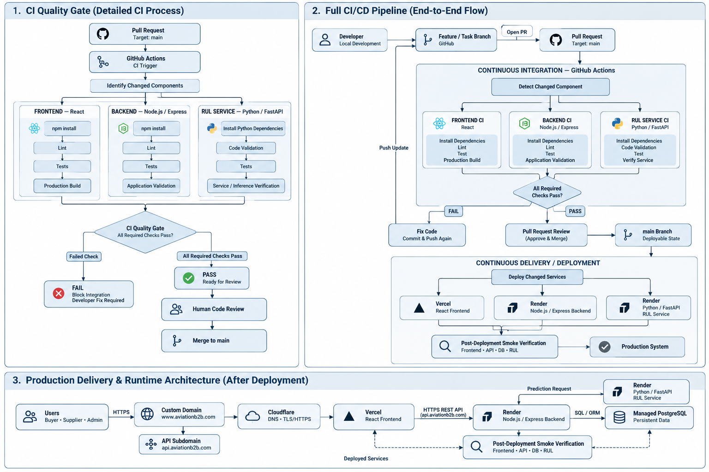

# CI/CD Architecture

## Overview

The Aviation B2B E-Commerce Platform uses a lightweight CI/CD workflow to control how application changes move from local development to the production environment.

The workflow follows a branch-based development process:

```text
Local Development
        ↓
Feature / Task Branch
        ↓
Pull Request
        ↓
Continuous Integration
        ↓
Code Review
        ↓
Merge to main
        ↓
Continuous Delivery / Deployment
        ↓
Post-Deployment Verification
        ↓
Production
```

The objective is to prevent unvalidated code from reaching the deployable `main` branch while keeping the delivery process simple enough for the current project scope.



---

## Development and Pull Request Flow

Development begins locally and changes are committed to a dedicated feature or task branch rather than directly to `main`.

When the work is ready for integration, the developer pushes the branch to GitHub and opens a Pull Request targeting `main`.

The Pull Request acts as the entry point to the CI pipeline:

```text
Developer
   ↓
Feature / Task Branch
   ↓
Pull Request → main
   ↓
GitHub Actions
```

This keeps development work separated from the deployable branch and provides a controlled point where automated validation and human review can occur.

---

## Continuous Integration

A Pull Request targeting `main` triggers the CI workflow through GitHub Actions.

Because the platform contains three application components with different technology stacks, the pipeline separates validation into:

| Component | Technology | CI Validation |
|---|---|---|
| Frontend | React | Install dependencies → Lint → Test → Production build |
| Backend | Node.js / Express | Install dependencies → Lint → Test → Application validation |
| RUL Service | Python / FastAPI | Install dependencies → Code validation → Test → Service verification |

The workflow first determines which application components are affected by the change. The relevant CI checks are then executed for those components.

This avoids treating the entire platform as a single application while still enforcing a common integration process.

### CI Quality Gate

The results of the component checks converge at a common quality gate.

```text
Frontend CI ─────┐
Backend CI ──────┼──→ CI Quality Gate
RUL Service CI ──┘
                       │
                 ┌─────┴─────┐
                 │           │
                FAIL        PASS
                 │           │
                 ↓           ↓
              Fix Code    PR Review
```

If a required check fails, the change is not considered ready for integration. The developer fixes the issue, commits the correction, and pushes an update to the same branch so that CI can run again.

Passing the automated checks does not immediately merge the code.

---

## Review and Integration

After the required CI checks pass, the Pull Request proceeds to human code review.

The complete integration path is therefore:

```text
Automated Validation
        ↓
CI Checks Pass
        ↓
Human Code Review
        ↓
Approve Pull Request
        ↓
Merge to main
```

The `main` branch represents the deployable state of the project.

This creates two validation boundaries before deployment: automated technical validation through GitHub Actions and manual review through the Pull Request process.

---

## Continuous Delivery and Deployment

After an approved Pull Request is merged into `main`, the delivery stage deploys the affected application services to their corresponding hosting platforms.

The production mapping used by the current project is:

| Application Component | Deployment Target |
|---|---|
| React Frontend | Vercel |
| Node.js / Express Backend | Render |
| Python / FastAPI RUL Service | Render |

The deployment flow is:

```text
main
  ↓
Deploy Changed Services
  │
  ├── React Frontend ───────→ Vercel
  │
  ├── Node.js / Express ────→ Render
  │
  └── Python / FastAPI ─────→ Render
```

Detailed production networking, custom-domain routing, Cloudflare configuration, PostgreSQL connectivity, and runtime communication between these services are documented separately in the **Cloud Deployment Architecture**.

This CI/CD design focuses specifically on how a source-code change reaches those production services.

---

## Post-Deployment Verification

A successful deployment does not by itself mean that the release is considered complete.

After deployment, a lightweight smoke verification checks whether the major production components are reachable and can perform their expected integration paths.

The verification covers the critical paths:

```text
Frontend → Backend API → PostgreSQL

Frontend → Backend API → RUL Service
```

At minimum, the verification should confirm that the frontend is accessible, the REST API responds correctly, database-dependent operations can reach PostgreSQL, and the backend can communicate with the RUL prediction service.

When these checks succeed, the deployed version is considered available as the production system.

---

## Failure and Recovery Flow

Failures are handled differently depending on where they occur.

A CI failure occurs before integration:

```text
CI Failure
    ↓
Block Integration
    ↓
Developer Fix
    ↓
Commit & Push
    ↓
CI Runs Again
```

This prevents known validation failures from progressing into `main`.

Deployment or smoke-verification failures occur after integration and must be investigated at the affected service. The deployment architecture and hosting logs are used to identify whether the problem originates from the frontend, backend, RUL service, database connectivity, or environment configuration.

---

## Configuration and Secrets

Sensitive configuration is kept outside the source code.

Local development uses environment files that are excluded from Git, while deployed services use environment variables configured on their hosting platforms.

Typical runtime configuration includes:

```text
DATABASE_URL
RUL_SERVICE_URL
JWT_SECRET
CORS_ORIGIN
MODEL_PATH
```

Secrets must not be committed directly to the repository or embedded in CI workflow files.

---

## Current Project Scope

The CI/CD strategy intentionally remains lightweight for the current project.

The core delivery path is:

```text
Feature Branch
      ↓
Pull Request
      ↓
GitHub Actions CI
      ↓
Quality Gate
      ↓
Human Review
      ↓
main
      ↓
Deploy Changed Services
      ↓
Vercel / Render
      ↓
Smoke Verification
      ↓
Production
```

The current design does not require Kubernetes, a dedicated container registry, complex multi-environment release orchestration, or an enterprise-scale deployment platform.

The objective is to establish a reproducible and controlled delivery process that matches the architecture and development scale of the Aviation B2B E-Commerce Platform.