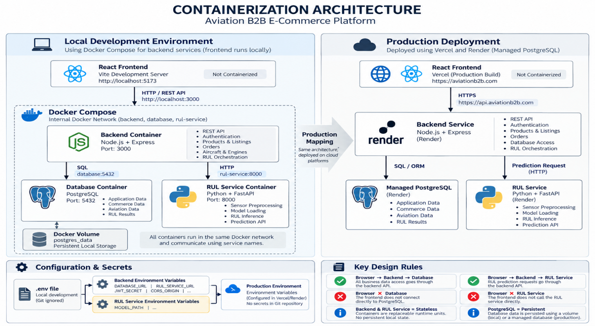

# Containerization Strategy

## 1. Purpose

The Aviation B2B E-Commerce Platform uses Docker to provide reproducible and
isolated runtime environments for application services.

Container boundaries follow the system architecture. The platform is not
packaged into one monolithic container. The Node.js/Express backend and Python
RUL inference service are treated as independent services because they use
different runtimes and have different responsibilities.

Docker Compose is planned for local integration of backend services. Production
deployment uses the hosting architecture defined in the deployment design.

---

## 2. Containerization Scope

| Component | Technology | Local Development | Production |
|---|---|---|---|
| Frontend | React | Local development server | Vercel |
| Backend API | Node.js / Express | Docker container | Render |
| RUL Service | Python / FastAPI | Docker container | Render |
| Database | PostgreSQL | Docker container | Managed PostgreSQL |

The React frontend is not required to run inside a production container because
Vercel builds and hosts the frontend application directly.

The backend and RUL service are containerized independently.

PostgreSQL is containerized only for local development. Production uses a
managed PostgreSQL instance so database persistence is separated from
application containers.

---
## Containerization Architecture

The following diagram shows how the platform services are containerized for
local development and how those logical services map to the production
environment.




## 3. Service Responsibilities

### Backend Container

Runtime:

Node.js / Express

Internal port:

3000

Responsibilities:

- expose the REST API used by the React frontend;
- authentication and authorization;
- marketplace business logic;
- product, listing, inventory and order operations;
- aircraft and engine operations;
- database access;
- coordinate RUL prediction requests.

The backend acts as the application gateway. The frontend does not communicate
directly with PostgreSQL or the RUL service.

### RUL Service Container

Runtime:

Python / FastAPI

Internal port:

8000

Responsibilities:

- expose the RUL prediction API;
- preprocess engine sensor input;
- load the trained prediction model;
- perform model inference;
- return predicted Remaining Useful Life to the backend.

The RUL service is separated from the Node.js backend because the machine
learning environment requires its own Python runtime and dependencies.

### PostgreSQL Container

Runtime:

PostgreSQL

Internal port:

5432

Responsibilities:

- store application and marketplace data;
- store companies, users, products and listings;
- store aircraft and engine information;
- store relevant RUL prediction results.

The PostgreSQL container is intended for local development only.

Database data is persisted using a Docker volume so that stopping or recreating
the database container does not automatically remove development data.

---

## 4. Local Development Architecture

The local backend environment is orchestrated using Docker Compose.

```text
Developer Browser
       |
       v
React Development Server
localhost:5173
       |
       | HTTP / REST
       v
+---------------- Docker Network ----------------+
|                                                |
|   Backend Container                            |
|   Node.js / Express                            |
|   :3000                                        |
|       |                         |               |
|       | SQL                     | HTTP          |
|       v                         v               |
|   PostgreSQL                RUL Service         |
|   :5432                     FastAPI :8000       |
|       |                                        |
|       v                                        |
|   Persistent Volume                            |
|                                                |
+------------------------------------------------+
```

Docker Compose provides a private network for the backend, RUL service and
PostgreSQL database.

Services communicate through Docker service names rather than localhost.

Example internal endpoints:

```text
backend -> database:5432
backend -> rul-service:8000
```

The browser accesses the backend through the host-exposed API port.

---

## 5. Service Communication

The normal e-commerce request flow is:

```text
React
  -> Backend REST API
  -> PostgreSQL
  -> Backend
  -> React
```

The predictive-maintenance request flow is:

```text
React
  -> Backend REST API
  -> RUL Service
  -> RUL Prediction
  -> Backend
  -> PostgreSQL (when the result must be persisted)
  -> React
```

The frontend never communicates directly with PostgreSQL.

The frontend also does not directly invoke the RUL service. The Express backend
remains the application API gateway between the client and internal services.

---

## 6. Configuration and Secrets

Runtime-specific configuration must not be hard-coded into application source
code.

Configuration is supplied through environment variables.

Typical backend configuration includes:

```text
PORT
DATABASE_URL
RUL_SERVICE_URL
JWT_SECRET
CORS_ORIGIN
```

Typical RUL service configuration includes:

```text
PORT
MODEL_PATH
```

Local development may use a `.env` file that is excluded from Git.

Production secrets and database credentials are configured through the selected
hosting platform rather than committed to the repository.

A `.env.example` file may be committed to document required configuration
without exposing secret values.

---

## 7. Persistence Strategy

Application containers are considered replaceable runtime units.

The backend and RUL containers should not depend on persistent local filesystem
state.

For local development, PostgreSQL data is stored using a Docker volume:

```text
PostgreSQL Container
        |
        v
Docker Volume
        |
        v
Persistent Development Data
```

In production, database persistence is delegated to the managed PostgreSQL
service.

This separates application lifecycle from database lifecycle.

---

## 8. Local and Production Mapping

The local Docker architecture and production deployment architecture serve
different purposes.

| Logical Component | Local | Production |
|---|---|---|
| React Frontend | Local dev server | Vercel |
| Express API | Docker | Render |
| RUL Service | Docker | Render |
| PostgreSQL | Docker + volume | Managed PostgreSQL |
| DNS / HTTPS | localhost | Cloudflare + custom domain |

Docker Compose reproduces the service relationships needed for development,
while production uses managed hosting services.


---

## 9. Containerization Design Summary

The containerization strategy therefore establishes three local backend runtime
units:

1. Node.js/Express backend;
2. Python/FastAPI RUL inference service;
3. PostgreSQL database.

The React frontend remains outside the local Docker environment for convenient
frontend development.

In production, React is hosted by Vercel, the application services are deployed
through Render, and PostgreSQL is provided as a managed database.

This design keeps the project simple enough for the current project scope while
preserving clear service boundaries between the e-commerce backend, predictive
maintenance service and persistent data layer.
