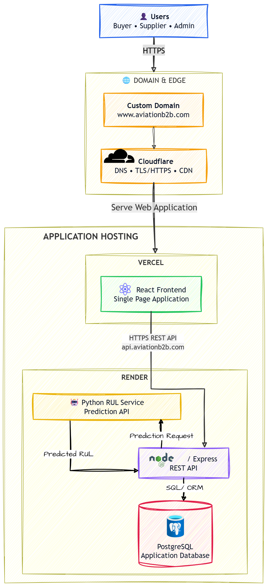

# Cloud Deployment Architecture

## Deployment Overview

The planned production platform uses a custom public domain managed by Cloudflare for DNS and HTTPS/TLS at the edge. Cloudflare directs users to the React frontend hosted on Vercel. The browser uses the platform's API domain to reach the Node.js/Express REST API hosted on Render. The Express backend is the application gateway to Render PostgreSQL and to the independently hosted Python RUL inference service, also on Render.

## Deployment Architecture




## Production Request Flow

```text
User
	-> custom domain
	-> Cloudflare (DNS and edge HTTPS/TLS)
	-> Vercel React frontend
	-> REST API via API domain/subdomain
	-> Render Node.js/Express backend
	-> Render PostgreSQL
```

The frontend runs in the user's browser and sends business-data requests to the Express REST API. The backend reads or updates PostgreSQL as needed and returns API responses to the frontend. The browser never connects directly to PostgreSQL.

## RUL Prediction Flow

```text
React frontend
	-> Express backend on Render
	-> Python RUL service on Render (backend-to-service call)
	-> prediction result returned to Express backend
	-> Render PostgreSQL, if the prediction/result must be persisted
	-> API response to the frontend
```

The Express backend coordinates prediction requests and remains the only RUL entry point for the frontend. It handles the returned result, persists it when required by the application flow, and responds to the browser through the REST API. The RUL service's actual internal URL is not specified here; the backend-to-service address is a deployment configuration detail, not a public domain decision.

## Planned Domain Structure

The purchased project domain has not been specified in this document. The intended hostname pattern is:

| Hostname pattern | Destination |
|---|---|
| `<project-domain>` | React frontend on Vercel |
| `www.<project-domain>` | React frontend on Vercel |
| `api.<project-domain>` | Express REST API on Render |

Cloudflare manages DNS and HTTPS/TLS for the public domain and its hostnames. These are patterns only; no specific domain or production service URL is implied.

## Current Implementation Status

This README documents the planned deployment architecture. It does not claim that the domain, Cloudflare configuration, Vercel frontend, Render services, or database have already been provisioned or deployed. The current document does not record a verified live deployment status.

## Component Responsibilities

| Component | Planned hosting | Responsibility |
|---|---|---|
| Public domain and edge | Custom domain with Cloudflare | DNS and HTTPS/TLS at the domain/edge layer |
| Frontend | React SPA on Vercel | User interface and browser-side API requests |
| REST API | Node.js/Express on Render | Application gateway for business data and RUL requests |
| Database | Render PostgreSQL | Relational application data and prediction results when persistence is required |
| RUL inference | Independent Python service on Render | Internal inference requests from the Express backend and prediction responses |